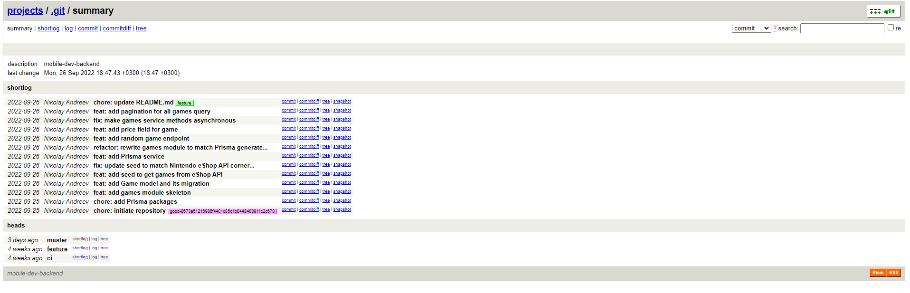
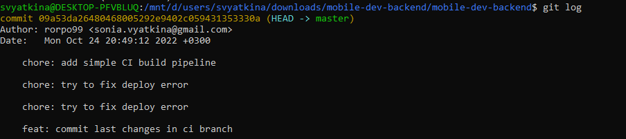
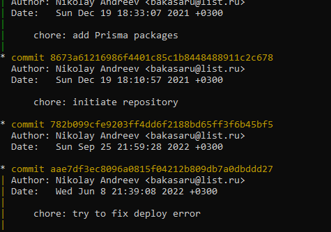
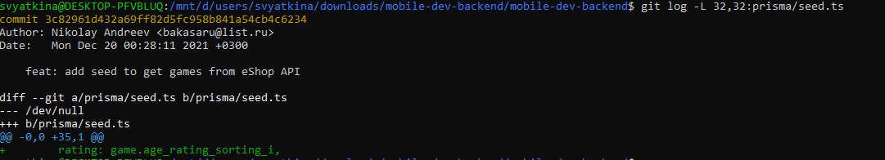

## M33031 Вяткина Софья 311442
### 1
С помощью команды **git instaweb --port=1236 --browse=w3m**
запускаем локальный веб-визуализатор репозитория. Описание репозитория меняем в файле .git/description

### 2
Последовательность команд:\
git checkout ci \
git rebase master -i \
git checkout master \
git merge ci \
git branch -d ci \
git log 

При rebase в интерактивном режиме у первого коммита оставляем pick, у всех остальных меняем pick на squash.

###3
С помощью команды **git log --reflog --graph** смотрим на граф и ищём несвязный с ним. 
 \
Создаём ветку на основе посднего коммита\
**git branch old-master aae7df3ec8096a0815f04212b809db7a0dbddd27**

###4
Используем **git log -L 32,32:prisma/seed.ts**

