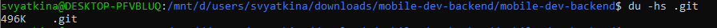

## M33031 Вяткина Софья 311442
### 1
С помощью команды **git instaweb --port=1236 --browse=w3m**
запускаем локальный веб-визуализатор репозитория. Описание репозитория меняем в файле .git/description

### 2
Последовательность команд:\
git checkout ci \
git rebase master -i \
git checkout master \
git merge ci \
git branch -d ci \
git log \

При rebase в интерактивном режиме у первого коммита оставляем pick, у всех остальных меняем pick на squash.

### 3
С помощью команды **git log --reflog --graph** смотрим на граф и ищём несвязный с ним. 
 \
Создаём ветку на основе посднего коммита\
**git branch old-master aae7df3ec8096a0815f04212b809db7a0dbddd27**

### 4
Используем **git log -L 32,32:prisma/seed.ts**

### 5
Используем последовательность команд:\
git bisect start \
git bisect bad  \
git bisect good 8673a61216986f4401c85c1b8448488911c2c678 \
git bisect run npm run test \
В качестве коммита, в котором нет ошибки указываем первый коммит.

Получили такой результат, теперь по строке, с помощью  **git log -S "Hello Universe!" --source --all**, найдем коммит, который приводит к ошибке.

Чтобы закончить поиск - **git bisect reset**

### 6
Перед тем как удалять .env, добавим его в .gitignore \
Командой **git filter-branch --prune-empty --index-filter "git rm --cached --ignore-unmatch .env" -- --all** перепишем коммиты.

После удалим бэкапы всех веток **git for-each-ref --format="%(refname)" refs/original/ | xargs -n 1 git update-ref -d**

### 7
Выполним **git filter-branch --env-filter "GIT_AUTHOR_NAME='Sofia Vyatkina' GIT_AUTHOR_EMAIL='sonia.vyatkina@gmail.com'" feature** \
 \
Видим, что информация в коммитах изменилась.

### 8
Включим запоминание разрешений конфликтов **config rerere.enabled true** \
Вливаем ветку feature в master и разрешаем конфликты.\
Откатываем слияние  **git reset --soft HEAD~1**\
Снова вливаем ветки, merge conflict решился автоматически.\

### 9 10
Используя команду **git fsck** получим

Далее посмтрим размеры папки .git 

Используя **git gc --aggressive --prune=now** "чистим" репозиторий

Снова смотрим размер папки .git и видим, что размер уменьшился

### 11
Для частичного индексирования используем **git commit -p REPORT.md** с опцией **e**
